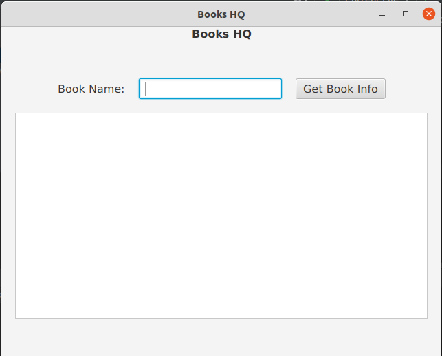
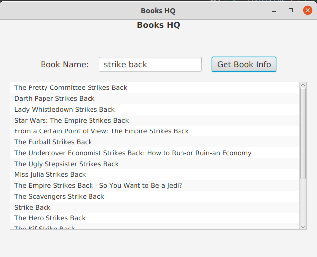
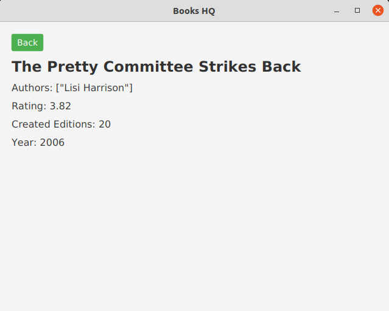

# BooksHQ

Look up and find details on any book you wish

## Screenshots

### Book search

### Books list

### Book details

## Setup

- Open the IDE of your choice, preferably Intellij IDEA
- Proceed to open this project in the IDE
- Give the IDE time to install dependencies and index the project components

## Usage

- Ensure that you have stable internet connection
- With `BooksHQ.java` open, hit the `Run` button to build and run the project
- On the first page, enter a book name of your choice and then hit `Get Book Info`
- Give it some time and you will get back a list of books
- Click on any to view more details about it
